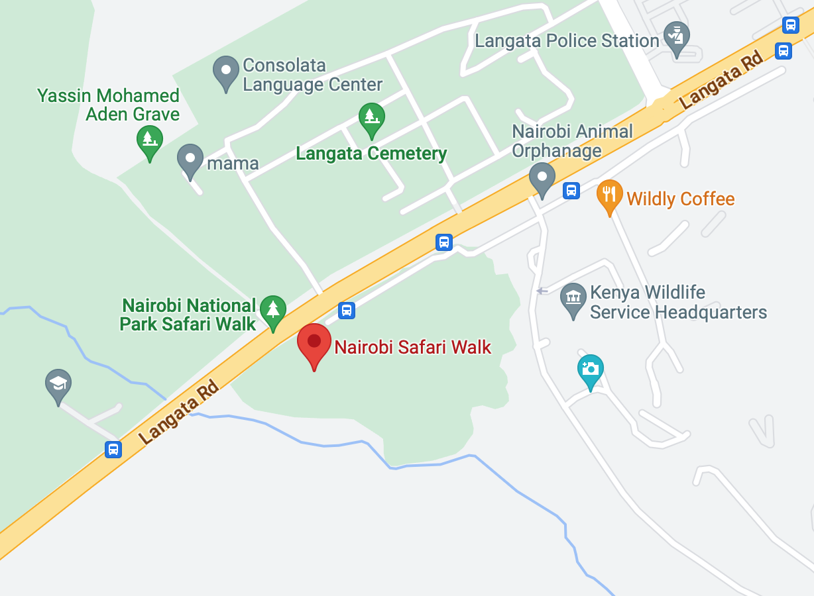

# Location Matching

Datasets on points-of-interest (POIs) are multi-sourced to provide accurate location and information for businesses, leisure hotspots, public utilities, eating and drinking places, and other geographic features. They can be very rich with real-world information.

To maintain the highest level of accuracy of large-scale POIs datasets, the data must be matched and de-duplicated with timely updates from multiple sources. De-duplication involves many challenges, as the raw data can contain noise, unstructured information, and incomplete or inaccurate attributes. 

The objective of this project is `matching POIs together to determine which place entries describe the same point-of-interest`, using a dataset of over **one million places entries** from kaggle where each place entry includes attributes such as name, street address, and coordinates.

**Evaluation**

The final model evaluated by the mean Intersection over Union (IoU, aka the Jaccard index) of the ground-truth entry matches and the predicted entry matches. The mean is taken sample-wise, meaning that an IoU score is calculated for each row, and the final score is their average.

> Using location neighbors (30 per entry) generated by Ball Tree algorithm the model achieved an IoU of 0.94 on training data, and the final model achieved an IoU of 0.30 using over 1M raw entries, more than 25M rows in train set, and about 8.5M rows in test set.
Training and test take about 7 hours.

### Brief summary of this solution

Before all I split data into train set (75%) and test set (25%) and filled in missing values, then to predict which place entries represent the same point-of-interest (POI) I proceeded as follows:

**Step 1: Candidates Generation** 
Extracting 30 location neighbors (i.e. match candidates) for each entry using Ball Tree algorithm.

**Step 2: Feature Engineering** 
Creating 71 new features based on the features of each entry and its match candidate (i.e. each pair id and id_match) such as: 
    - Cosine similarity between text fields like name, address, city, category, country, etc. 
    - Longest common subsequence between text fields. 
    - Latitude longitude distance. 
    - Latitude longitude rank. 
    - Levenshtein distance between text features.

**Step 3: Matching** 
Developing a binary classification LightGBM model using a matching threshold equals 0.5 and binary_logloss loss function.

**Step 4: Post-processing** 
Adding the inverse type of pairs that may be missing from the matches list. For example, if A B is a match, then B A should also be a match. In other words, if B exists in A matches list, then A should exist in B matches list.

### Notebook Content
    Imports
    Setup
    Utility Functions
    1  Loading Data
    2  Preparing Data
    3  Preprocessing
    4  Candidates Generation
    5  Feature Engineering
    6  Evaluation
    7  Classification
    8  Prediction
    9  Post-processing
    10 Output
    11 Pipelines
    12 Training Evaluation and Testing
    13 Inference
    14 Debugging

